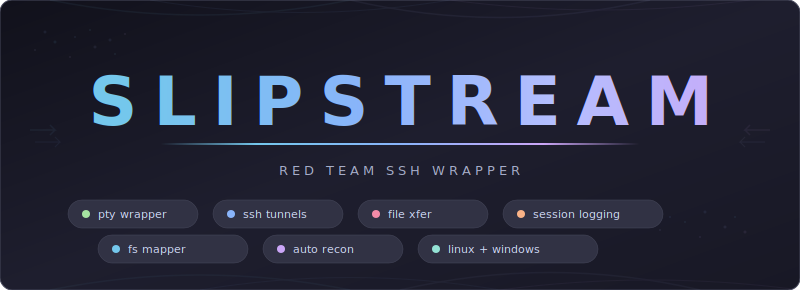

<div align="center">



<br>

Slipstream is an SSH wrapper for red team operations, written in Rust. It wraps the system's real `ssh` binary via PTY, intercepting `!` commands to provide session management, tunnel management, file transfers, passive filesystem mapping, and per-command session logging — while passing all SSH functionality through unchanged. Works against both Linux and Windows targets.

</div>

<br>

## Table of Contents

- [Highlights](#highlights)
- [Quick Start](#quick-start)
- [Architecture](#architecture)
- [Commands](#commands)
- [Internals](#internals)
- [Project Structure](#project-structure)
- [Future Work](#future-work)

---

## Highlights

<table>
<tr>
<td width="50%">

### Drop-In SSH Replacement
All SSH flags, `-o` options, and `~/.ssh/config` work as normal. Slipstream parses what it needs (host, user, port) and passes everything else unchanged to the real `ssh` binary. Your workflow doesn't change.

</td>
<td width="50%">

### Tunnel Management
iptables-style syntax for SSH tunnels: `!tunnel add --type socks -p 1080`. Real forwarding via `ssh -O forward` over the master socket. Add, delete, list, flush, save, and restore tunnel configurations per target.

</td>
</tr>
<tr>
<td width="50%">

### File Transfers
`!upload` and `!download` with an automatic fallback chain: SFTP, SCP, cat-over-SSH, base64. Windows paths with backslashes are handled transparently via forward-slash conversion. No separate SCP session needed.

</td>
<td width="50%">

### Passive Filesystem Mapper
Slipstream watches your commands and parses the output. Run `ls`, `dir`, `find`, `net user`, `ipconfig` — the mapper builds a searchable map of the remote filesystem without sending extra commands.

</td>
</tr>
<tr>
<td width="50%">

### Per-Command Session Logging
Every command gets its own timestamped log file. A session index tracks what you ran and when. Built for OSCP exam proof and engagement reporting — no more lost terminal history.

</td>
<td width="50%">

### Target Identity by Fingerprint
Targets are identified by SSH host key fingerprint, not IP. Reconnect after DHCP changes, access dual-homed hosts, or reuse lab IPs — Slipstream knows it's the same (or different) machine.

</td>
</tr>
</table>

---

## Quick Start

### Prerequisites

| Requirement | Version |
|-------------|---------|
| Rust | 1.70+ |
| OpenSSH | 6.8+ (client) |
| Target | Any SSH server (Linux or Windows) |

### Build

```bash
# Clone
git clone https://github.com/Real-Fruit-Snacks/Slipstream.git
cd Slipstream

# Build
cargo build --release

# Binary at target/release/slipstream (~2.4 MB)
```

### Usage

```bash
# Connect — same as ssh, all flags work
slipstream ssh user@10.10.10.5
slipstream ssh -i ~/.ssh/key -o StrictHostKeyChecking=no admin@target

# Inside the session — ! commands
!help                                    # Show all commands
!tunnel add --type socks -p 1080         # SOCKS proxy
!tunnel add --type local -s 8080 -d 10.10.10.50 -p 80  # Port forward
!upload linpeas.sh /tmp/                 # Upload file
!download /etc/shadow ./loot/            # Download file
!loot                                    # Auto-grab common recon files
!exec whoami                             # Run command via control socket
!note This is the DC                     # Annotate the target
!map                                     # Show mapped filesystem
!sessions                                # List sessions

# Clean up engagement data
slipstream clean
slipstream clean --target SHA256:abc123
```

> Bash history expansion (`!!`, `!$`, `!-1`) passes through to SSH — only known Slipstream commands are intercepted.

---

## Architecture

```
+---------------------------------------------------------+
|                     slipstream                          |
|                                                         |
|  +------------+    +-------------------------------+    |
|  | PTY Layer  |<-->| Input Interceptor             |    |
|  |            |    | (prompt-aware, cooked/raw)     |    |
|  +-----+------+    +-------------+-----------------+    |
|        |                         |                      |
|  +-----v------+    +------------v-----------------+     |
|  | SSH Child   |    | Command Router               |    |
|  | Process     |    |                              |    |
|  | (real ssh)  |    | !tunnel  !upload  !exec      |    |
|  +-----+------+    | !map     !loot    !note       |    |
|        |           | !sessions !connect !help ...   |    |
|  +-----v------+    +------------------------------+     |
|  | Master      |                                        |
|  | Socket      |    +-------------+  +-----------+      |
|  | (Control)   |    | Log Engine  |  | FS Mapper |      |
|  +-------------+    +-------------+  +-----------+      |
+---------------------------------------------------------+
```

| Layer | Implementation |
|-------|----------------|
| **Transport** | Wraps real `ssh` binary via PTY — all SSH features pass through |
| **Multiplexing** | `ControlMaster=auto` with Slipstream-owned socket path |
| **Tunnels** | `ssh -O forward` / `ssh -O cancel` via master socket |
| **Transfers** | SFTP / SCP / cat / base64 fallback chain over master socket |
| **Logging** | Per-command files + session index with timestamps |
| **Mapping** | Passive output parsing — `ls`, `dir`, `find`, `net user`, `ipconfig` |
| **Identity** | SSH host key fingerprint as primary key, conflict detection |
| **OS Detection** | Auto-detects Linux vs Windows from SSH output |

---

## Commands

### Session

| Command | Description |
|---------|-------------|
| `!sessions` | List active sessions with labels |
| `!switch <id>` | Switch to session by ID |
| `!connect <target>` | Open new session in tmux window |
| `!rename <id> <label>` | Label a session (e.g., "DC", "web-server") |
| `!kill <id>` | Kill session and its tunnels |
| `!bg` | Background info (Ctrl+Z / tmux) |

### Tunnels

| Command | Description |
|---------|-------------|
| `!tunnel add --type socks -p 1080` | SOCKS proxy |
| `!tunnel add --type local -s 8080 -d host -p 80` | Local port forward |
| `!tunnel add --type reverse -s 9090 -d 127.0.0.1 -p 4444` | Reverse forward |
| `!tunnel list [-v]` | List active tunnels |
| `!tunnel del <id>` | Remove tunnel (executes `ssh -O cancel`) |
| `!tunnel flush` | Remove all tunnels |
| `!tunnel save` | Save tunnel config to target data |
| `!tunnel restore` | Restore saved tunnels on reconnect |

### File Transfer

| Command | Description |
|---------|-------------|
| `!upload <local> <remote>` | Upload file (SFTP > SCP > cat > base64) |
| `!download <remote> <local>` | Download file (same fallback chain) |
| `!upload --method scp <local> <remote>` | Force specific method |
| `!transfer-method [method]` | Get or set default transfer method |

### Filesystem Mapper

| Command | Description |
|---------|-------------|
| `!map` | Show mapped filesystem tree |
| `!map /path` or `!map C:\path` | Browse specific directory |
| `!map find *.conf` | Search by pattern |
| `!map find suid` | Find SUID binaries |
| `!map users` | Show discovered users |
| `!map coverage` | Show explored directories |
| `!map export` | Export map as JSON |
| `!map reset` | Clear map data |

### Red Team QOL

| Command | Description |
|---------|-------------|
| `!loot [dir]` | Auto-grab common recon files (passwd, shadow, SAM, ipconfig, etc.) |
| `!exec <cmd>` | Run command via control socket (doesn't pollute interactive session) |
| `!note <text>` | Add timestamped note to target |
| `!note` | View all notes for current target |

### Help

| Command | Description |
|---------|-------------|
| `!help` | Show all commands |
| `!help <command>` | Detailed help for a command |
| `!?` | Alias for `!help` |
| `!<command> --help` | Help for any command |

---

## Internals

### Input Interception

Slipstream uses a **prompt-aware interception model**. In cooked mode (normal shell), it buffers input and checks for `!<known_command>`. Unknown `!` sequences (`!!`, `!$`, `!foobar`) pass through to SSH for bash history expansion. In raw mode (vim, top, less, tmux), all input passes through unmodified — detected via alternate screen buffer escape sequences.

### Target Identity

Targets are identified by SSH host key fingerprint, captured from `ssh -v` output during handshake. The fingerprint is the primary key — IP addresses are metadata. This handles DHCP changes, dual-homed hosts, and lab IP reuse. When a fingerprint changes for a known IP, Slipstream prompts: Archive, Keep, or Ignore.

### OS Detection

Slipstream auto-detects the target OS from SSH output (presence of "Windows", "Microsoft", `C:\`, etc.) and adapts:

| Feature | Linux | Windows |
|---------|-------|---------|
| Mapper parsers | `ls`, `find`, `tree`, `/etc/passwd` | `dir`, `net user`, `ipconfig` |
| CWD tracking | `/` separator | `\` separator |
| Transfer paths | Forward slashes | Auto-converted forward slashes |
| Boundary detection | `PROMPT_COMMAND` | PowerShell `prompt` function |
| User hint | "Run: cat /etc/passwd" | "Run: net user" |
| Loot targets | shadow, crontab, suid | SAM, systeminfo, tasklist |

### Data Organization

```
~/.config/slipstream/
+-- config.toml                         # Global config (optional)
+-- targets/
|   +-- SHA256-fingerprint/
|       +-- target.toml                 # Identity, addresses, saved tunnels
|       +-- notes.txt                   # Target annotations
|       +-- map.json                    # Filesystem map
|       +-- logs/
|           +-- 2026-03-20_14-30-00/
|               +-- session.log         # Command index with timestamps
|               +-- 001_whoami.log      # Per-command output
|               +-- 002_ls_-la.log
+-- sessions/
    +-- ssh-host-pid.sock               # Master socket (runtime only)
```

---

## Project Structure

```
slipstream/
+-- src/
|   +-- lib.rs                # Library root
|   +-- main.rs               # Entry point, PTY spawn, I/O loop
|   +-- config.rs             # TOML config with sane defaults
|   +-- pty_loop.rs           # Command dispatch, transfer/mapper/tunnel wiring
|   +-- target_os.rs          # TargetOS enum with auto-detection
|   +-- signals.rs            # SIGWINCH/SIGHUP/SIGTERM handlers
|   +-- ssh/
|   |   +-- discovery.rs      # Find real ssh binary on $PATH
|   |   +-- args.rs           # Parse SSH arguments
|   |   +-- process.rs        # Build SSH command with ControlMaster
|   |   +-- fingerprint.rs    # Parse host key from ssh -v
|   |   +-- orphan.rs         # Stale socket detection
|   +-- target/
|   |   +-- identity.rs       # Fingerprint-based target resolution
|   |   +-- storage.rs        # target.toml read/write
|   |   +-- conflict.rs       # Archive/Keep/Ignore prompts
|   +-- input/
|   |   +-- mode.rs           # Cooked/raw terminal mode
|   |   +-- line_buffer.rs    # Keystroke buffer
|   |   +-- router.rs         # ! command routing
|   +-- logging/
|   |   +-- engine.rs         # Session + per-command logs
|   |   +-- boundary.rs       # PROMPT_COMMAND marker detection
|   |   +-- writer.rs         # Atomic file writes with flock
|   +-- session/
|   |   +-- manager.rs        # Session lifecycle
|   +-- tunnel/
|   |   +-- manager.rs        # Tunnel CRUD + SSH forward execution
|   +-- transfer/
|   |   +-- fallback.rs       # Transfer methods + fallback chain
|   +-- mapper/
|   |   +-- parser.rs         # Output parsers (ls, dir, find, net user, ipconfig)
|   |   +-- store.rs          # map.json with merge-on-add
|   |   +-- query.rs          # find, coverage, export, tree
|   |   +-- cwd.rs            # Working directory tracker
|   +-- commands/
|       +-- help.rs           # Help system
|       +-- tunnel_cmd.rs     # Tunnel display formatting
+-- tests/                    # 118 integration tests
+-- docs/
    +-- banner.svg
    +-- superpowers/specs/    # Design specification
    +-- superpowers/plans/    # Implementation plan
```

~6,400 lines of Rust. 38 source files. 118 tests. 2.4 MB binary.

---

## Future Work

- True multi-session PTY multiplexing (currently tmux-based)
- Tab completion for `!` commands
- `!portscan` via bash `/dev/tcp` probes
- Auto-proxychains config after SOCKS tunnel creation
- PowerShell `Get-ChildItem` parser for mapper
- Session auto-reconnect with exponential backoff

---

<div align="center">

**Rust. Cross-platform. Zero config.**

*Slipstream — SSH wrapper for red team operations*

---

**For authorized use only.** This tool is intended for legitimate security research, authorized penetration testing, and educational purposes. Unauthorized access to computer systems is illegal. Users are solely responsible for ensuring compliance with all applicable laws and obtaining proper authorization before use.

</div>
